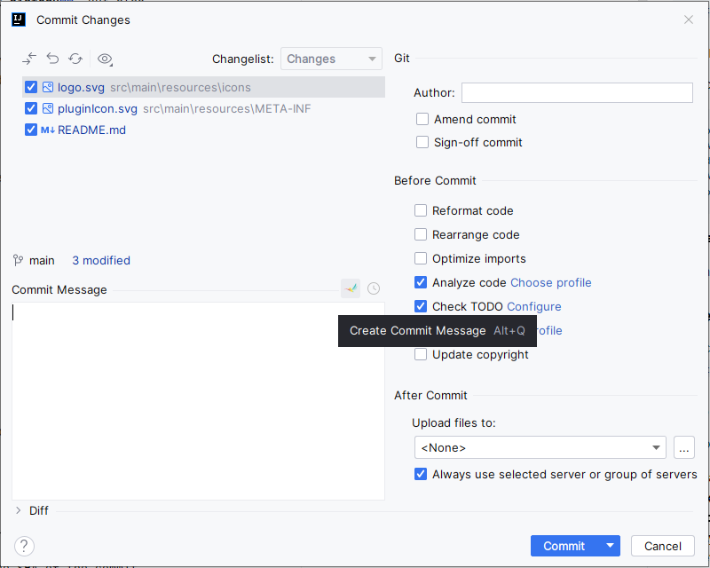
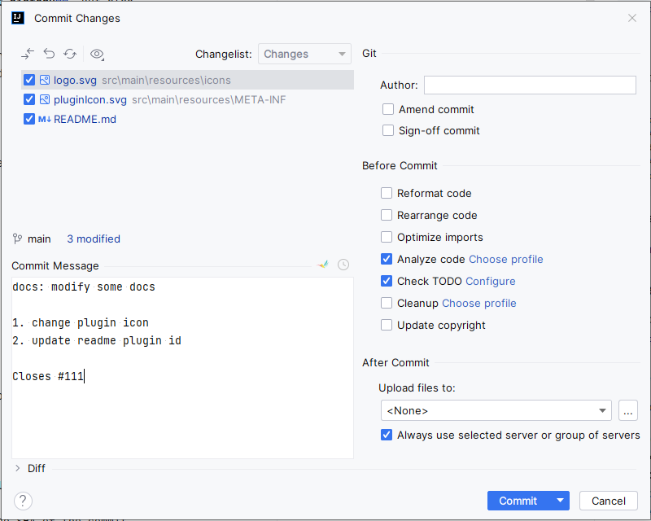

# Git Commit Message Format

[][gh:build]
[][jb:git-commit-message-format]
[][jb:git-commit-message-format]

[][gh:landscape:flogo]

<!-- Plugin description -->

## Git Commit Guidelines

We have very precise rules over how our git commit messages can be formatted. This leads to **more
readable messages** that are easy to follow when looking through the **project history**. But also,
we use the git commit messages to **generate the AngularJS change log**.

The commit message formatting can be added using a typical git workflow or through the use of a CLI
wizard ([Commitizen][gh:cz-cli]). To use the wizard, run `yarn run commit`
in your terminal after staging your changes in git.

### Commit Message Format

Each commit message consists of a **header**, a **body** and a **footer**. The header has a special
format that includes a **type**, a **scope** and a **subject**:

```
<type>(<scope>): <subject>
<BLANK LINE>
<body>
<BLANK LINE>
<footer>
```

The **header** is mandatory and the **scope** of the header is optional.

Any line of the commit message cannot be longer than 100 characters! This allows the message to be easier
to read on GitHub as well as in various git tools.

### Revert

If the commit reverts a previous commit, it should begin with `revert: `, followed by the header
of the reverted commit.
In the body it should say: `This reverts commit <hash>.`, where the hash is the SHA of the commit
being reverted.

### Type

Must be one of the following:

* **feat**: A new feature
* **fix**: A bug fix
* **docs**: Documentation only changes
* **style**: Changes that do not affect the meaning of the code (white-space, formatting, missing
  semi-colons, etc)
* **refactor**: A code change that neither fixes a bug nor adds a feature
* **perf**: A code change that improves performance
* **test**: Adding missing or correcting existing tests
* **chore**: Changes to the build process or auxiliary tools and libraries such as documentation
  generation

### Scope

The scope could be anything specifying place of the commit change. For example `$location`,
`$browser`, `$compile`, `$rootScope`, `ngHref`, `ngClick`, `ngView`, etc...

You can use `*` when the change affects more than a single scope.

### Subject

The subject contains succinct description of the change:

* use the imperative, present tense: "change" not "changed" nor "changes"
* don't capitalize first letter
* no dot (.) at the end

### Body

Just as in the **subject**, use the imperative, present tense: "change" not "changed" nor "changes".
The body should include the motivation for the change and contrast this with previous behavior.

### Footer

The footer should contain any information about **Breaking Changes** and is also the place to
[reference GitHub issues that this commit closes][gh:closing-issues].

**Breaking Changes** should start with the word `BREAKING CHANGE:` with a space or two newlines.
The rest of the commit message is then used for this.

A detailed explanation can be found in
this [document][docs:commit-message-format].

<!-- Plugin description end -->

## Installation

- Using IDE built-in plugin system:

  <kbd>Settings/Preferences</kbd> > <kbd>Plugins</kbd> > <kbd>Marketplace</kbd> > <kbd>Search for "Git Commit Message
  Format"</kbd> >
  <kbd>Install Plugin</kbd>

- Manually:

  Download the [latest release][gh:releases-latest] and install it
  manually using <kbd>Settings/Preferences</kbd> > <kbd>Plugins</kbd> > <kbd>⚙️</kbd> > <kbd>Install plugin from
  disk...</kbd>

## Usage






## Reference

- [AngularJS's commit message convention][docs:commit-message-convention]
- [The commitizen command line utility][gh:cz-cli]
- [Commit message 和 Change log 编写指南][docs:commit-message-change-log]
- [Git Commit Template][gh:commit-template-idea-plugin]
- [Git Commit Message Helper][gh:git-commit-message-helper]

---
Plugin based on the [IntelliJ Platform Plugin Template][gh:intellij-platform-plugin-template].


[gh:build]: https://github.com/fobgochod/git-commit-message-format/actions?query=workflow%3ABuild
[gh:closing-issues]: https://help.github.com/articles/closing-issues-via-commit-messages/
[gh:releases-latest]:https://github.com/fobgochod/git-commit-message-format/releases/latest
[gh:cz-cli]: https://github.com/commitizen/cz-cli
[gh:commit-template-idea-plugin]: https://github.com/MobileTribe/commit-template-idea-plugin
[gh:git-commit-message-helper]: https://github.com/AutismSuperman/git-commit-message-helper
[gh:intellij-platform-plugin-template]: https://github.com/JetBrains/intellij-platform-plugin-template

[gh:landscape:flogo]: https://github.com/cncf/landscape/blob/master/hosted_logos/flogo.svg
[jb:git-commit-message-format]: https://plugins.jetbrains.com/plugin/20935
[docs:commit-message-format]: https://docs.google.com/document/d/1QrDFcIiPjSLDn3EL15IJygNPiHORgU1_OOAqWjiDU5Y/edit#
[docs:commit-message-change-log]: http://www.ruanyifeng.com/blog/2016/01/commit_message_change_log.html
[docs:commit-message-convention]: https://github.com/angular/angular.js/blob/master/DEVELOPERS.md#-git-commit-guidelines
